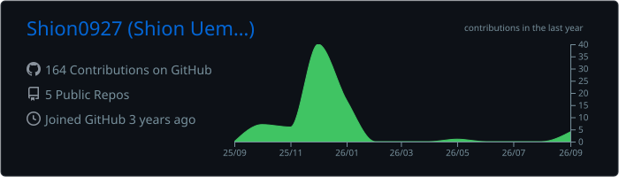
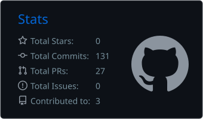
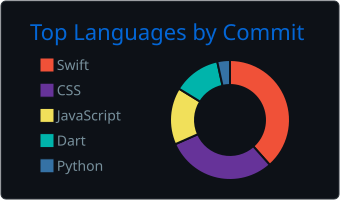

<!-- 言語切替 / Language switch -->

  <b>日本語</b> &nbsp;|&nbsp; <a href="./README.en.md">English</a>

<h1 align="center">Hi there, I'm Shion Uemura 👋</h1>

  モバイルアプリと Web アプリを、Swift / Flutter / JavaScript / Python で作っています。 
  「毎日使うのが面倒なもの」を、少しだけ楽にするツールづくりが好きです。

<!-- SNS・外部リンクを置きたくなったらここに追加

  
  

-->

---

## 🧑‍💻 About Me

- 📱 iOS（Swift）と Flutter でのアプリ開発を中心に、Web フロント（JavaScript）や Python も触っています
- 🔔 「一覧を眺める」より「必要なときだけ通知で知らせる」ような、生活に寄り添う UX に興味があります
- 🛠️ 一度作ったものを納得いくまで作り直すタイプです
- 🌱 いま取り組んでいること: **WeatherCue** の改善と **StudyPalette** の再構築

## 🛠️ Tech Stack

  
  
  
  
  

  
  
  

## 🚀 Projects

| プロジェクト | 概要 | 技術 |
| :--- | :--- | :--- |
| [**WeatherCue**](https://github.com/Shion0927/WeatherCue) | 通知中心の天気アプリ | Swift / iOS |
| [**StudyPalette**](https://github.com/Shion0927/StudyPalette) | 学習記録アプリ | Flutter / Dart |
| [**CalendarApp**](https://github.com/Shion0927/CalendarApp) | カレンダーアプリ | Python |
| [**mysearch_proj**](https://github.com/Shion0927/mysearch_proj) | 検索アプリ | JavaScript |

## 📊 GitHub Stats

  

  
  

  

---

  

